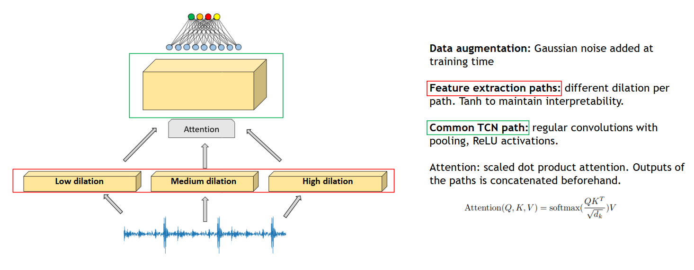

# vibnet
End-to-end neural network for time series classification

VibNet is a novel temporal convolutional neural network architecture, designed for supervised classification problems from raw time domain data.

We tested our architecture against the Case Western Reserve University [4] dataset for mechanical bearing fault classification.
The main advantage of our solution over other state-of-the-art techniques involving convolutions is that it is completely end-to-end, time domain to classification result, thus making it very appealing for time sensitive, online fault monitoring applications. Furthermore, we exploit pre-existing characteristics of time series to achieve improved interpretability. We do so by applying a strong inductive bias in the first few layers via dilated convolutions. Additionally, we add multiple parallel convolutional paths as to achieve a so called "multi-head" architecture, where each path has a different dilation coefficient. 

The intuition behind dilation is that it is a form of downsampling of the signal. Different dilation coefficients cause downsampling of different magnitudes. By forcing the network to use features of signals downsampled to different frequencies we can learn more about which frequency bands the network chooses to focus on while at the same time teaching it about the nature of its input data. 

## Advantages over other state of the art techniques

### End-to-end approach

Other state of the art approaches for fault condition monitoring suffer from one key issue. While deep learning approaches in general stick to a more minimalistic form of data preprocessing, straying away from performing wavelet analysis or creating theoretically sound, complex signal processing features manually or in a pipeline from the raw data in the time domain, they still rely on frequency information being part of the input to the network. This is often done via FFTs (fast fourier transform)
of the time series data, that are then added to the raw data as additional input channels. In embedded, online, time critical applications this far from the optimal solution. We can leverage the strong expressivity of CNNs to solve the problem in a complete end-to-end fashion, directly from time domain to fault type. This feature of VibNets makes them particularly easy to implement in embedded systems, particularly so via weight quantization or other network compression techniques.

### Interpretability

Since deep learning based systems have become prevalent in many industries and are sometimes at the core of sensitive decision making strategies, many researchers and practicioners are realizing the importance of peeking in and understanding what really goes on inside the magic black box. Other very recent works [5] have tried to tackle interpretability in signal processing by placing strong biases in the first convolutional layers. The argument goes as follows: even if the network starts with only time domain data, by architectural choices we can 'teach' it about the frequency domain and the periodic nature of the input data. As a side effect, a stronger bias also helps combat overfitting, problem which can often occur in applications with small training datasets.

It is particularly appealing to draw parallels between this type of problem and the issue of image segmentation in computer vision. Historically, there have been many different approaches for finding meaningful segmentation of image data, starting with multi-stage approaches (RCNN) in 2015. Nowadays one stage techniques are more popular due to their versatility and the fact that they can be used in online applications. The goal is then that of embedding the segmentation process inside the architecture. In signal processing the goal to strive for is still obtaining interpretable, orthogonal components, with the caveat that this time they are not in pixel space but in frequency domain, which can be viewed as a latent space of the input time series. This adds complexity to this issue.

